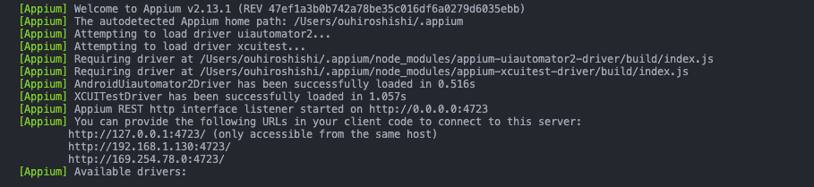

# Appium APP Agentic Engineering Automation

[English](README.md) | **中文**

> 以 Agentic 工作流驅動的行動端 E2E 自動化框架 — Claude 探索真實 App、建立 locator 證據圖、自動生成 BDD 自動化程式碼。不用手動找 selector，不用靠猜。

[](https://www.python.org/)
[](https://appium.io/)
[](https://pytest-bdd.readthedocs.io/)
[](https://github.com/astral-sh/uv)
[](https://allurereport.org/)
[]()

---

## Demo

<video src="https://github.com/user-attachments/assets/52750420-5995-49c1-b5f9-ee03b40b876a" controls autoplay loop muted width="100%"></video>

---

## 功能概覽

| 功能 | 說明 |
|---|---|
| **Agentic 探索** | Planner agent 在真實裝置上走過每個 `@auto` scenario，從即時 Accessibility tree 中提取已驗證的 locator |
| **Evidence 驅動生成** | Generator agent 讀取證據圖，產生 Screen Objects 和 step definitions — 每個 selector 都可溯源回真實裝置的證據 |
| **自動修復** | Healer agent 重跑失敗測試、檢查真實裝置狀態、分類根本原因、套用最小化修正 |
| **跨平台** | 單一程式碼庫驅動 iOS（XCUITest）和 Android（UiAutomator2）；平台差異封裝在 Screen method 內，不洩漏到測試層 |
| **BDD 優先** | Feature file 是唯一真相；自動化程式碼是衍生產物 |
| **並行執行** | pytest-xdist 跨 worker 分配 scenario；iOS 和 Android 分開執行 |
| **Allure 報告** | 每步驟截圖、裝置 metadata、失敗差異比對 |

---

## 技術棧

| 層級 | 技術 | 版本 |
|---|---|---|
| 測試執行器 | pytest | 8.x |
| BDD 框架 | pytest-bdd | 7.x |
| 行動裝置驅動 | Appium | 3.x |
| iOS 自動化 | XCUITest driver | latest |
| Android 自動化 | UiAutomator2 driver | latest |
| Python 客戶端 | Appium-Python-Client | 4.x |
| 套件管理 | uv | latest |
| 設定管理 | pydantic-settings + YAML + .env | 2.x |
| 報告 | Allure | 2.x |
| 並行執行 | pytest-xdist | 3.x |
| 測試資料 | Faker | 24.x |

---

## 架構

四層。依賴關係單向由上而下，不得例外。

```
┌─────────────────────────────────────────────┐
│              Feature Files                  │  Gherkin — 人類可讀，標記 @auto
├─────────────────────────────────────────────┤
│              Step Definitions               │  解析參數 → 呼叫 Screen → 斷言
├─────────────────────────────────────────────┤
│              Screen Objects                 │  以業務意圖命名的方法，繼承 BaseScreen
├─────────────────────────────────────────────┤
│                   Core                      │  Appium driver、waits、locators、session
└─────────────────────────────────────────────┘
```

| 層級 | 路徑 | 規則 |
|---|---|---|
| Feature files | `features/` | 唯一真相；generator 不得修改 |
| Step definitions | `tests/steps/` | 不含 selector、不直接呼叫 driver — 只解析參數、呼叫 Screen、斷言 |
| Screen Objects | `screens/` | 所有 Appium 呼叫透過 `BaseScreen`；方法以業務意圖命名 |
| Core | `core/` | 不得 import `screens/`、`tests/`、`api/` |

---

## 專案結構

```
├── features/                  # Gherkin feature files（@auto scenario）
│   ├── auth/
│   └── home/
├── tests/
│   ├── steps/                 # 各 feature 對應的 step definitions
│   │   ├── test_signup.py
│   │   └── test_home.py
│   ├── unit/                  # 不需裝置的單元測試（core、config、api）
│   └── conftest.py
├── screens/                   # Screen Objects
│   ├── catalog.py             # Lazy cached_property 注冊表
│   ├── home_screen.py
│   ├── signup_screen.py
│   └── ...
├── core/
│   ├── base_screen.py         # 所有 Appium 呼叫的入口
│   ├── locator.py             # Locator(by, value, name)
│   ├── wait.py                # wait_visible / wait_not_visible / wait_enabled
│   ├── driver_factory.py
│   └── app_session.py
├── config/
│   ├── settings.py            # Pydantic Settings；env var > caps yaml > env yaml
│   ├── capabilities/          # ios.yaml / android.yaml
│   └── environments/          # staging.yaml / prod.yaml
├── api/                       # 薄層 HTTP 客戶端，用於測試資料建立
├── flows/                     # 跨 Screen 的可重用流程
├── utils/                     # Faker 驅動的資料工廠
├── evidence/                  # Planner 輸出：每個 scenario 的真實 locator 證據
├── apps/                      # App 二進位檔（.app / .apk）— gitignored
└── scripts/
    └── check-env.sh           # 本機環境體檢腳本
```

---

## 環境需求

| 工具 | 版本 | 用途 |
|---|---|---|
| Python | ≥ 3.11 | 執行環境 |
| uv | latest | 套件與虛擬環境管理 |
| Appium | 3.x | 行動自動化伺服器 |
| XCUITest driver | latest | iOS（`appium driver install xcuitest`） |
| UiAutomator2 driver | latest | Android（`appium driver install uiautomator2`） |
| Xcode + xcrun | latest | iOS 模擬器管理（僅 macOS） |
| Android SDK (adb) | latest | Android 模擬器 / 實機 |

一鍵驗證所有環境：

```bash
bash scripts/check-env.sh
```

---

## Appium 安裝設定

### 安裝 Appium 與 drivers

```bash
npm install -g appium
appium driver install xcuitest      # iOS
appium driver install uiautomator2  # Android
```

### 啟動 Appium

```bash
appium --port 4723
```

成功啟動後，兩個 driver 都會載入，REST interface 監聽 `:4723`：



---

## WebDriverAgent 設定（僅 iOS）

WebDriverAgent（WDA）是 iOS 的驅動橋接層，由 XCUITest driver 在第一次建立 session 時自動建置並安裝。**模擬器不需要手動操作。**

**真機需要 code signing：**

1. 開啟 WDA 專案：

   ```bash
   open ~/.appium/node_modules/appium-xcuitest-driver/node_modules/appium-webdriveragent/WebDriverAgent.xcodeproj
   ```

2. 在 Xcode → Signing & Capabilities，為 `WebDriverAgentLib` 和 `WebDriverAgentRunner` 兩個 target 設定 **Team** 和 **Bundle Identifier**。

3. 執行環境體檢確認一切就緒：

   ```bash
   bash scripts/check-env.sh
   ```

模擬器第一次執行時 WDA 會自動靜默建置，不需任何額外操作。

---

## 快速開始

```bash
# 1. Clone
git clone https://github.com/JulianWangHZ/Appium-APP-Agentic-Engineering-Automation.git
cd Appium-APP-Agentic-Engineering-Automation

# 2. 安裝依賴
uv sync

# 3. 設定環境變數（見下方「設定」段落）
cp .env.example .env

# 4. 啟動 Appium
appium --port 4723

# 5. 執行
uv run pytest -m smoke --platform=ios
```

---

## 執行測試

### 依 suite

```bash
uv run pytest -m smoke      --platform=ios
uv run pytest -m regression --platform=android
```

### 依 scenario 關鍵字

```bash
uv run pytest -k "user signs up with valid credentials" --platform=ios
```

### 並行執行

```bash
uv run pytest -m regression --platform=ios -n 2
```

### 只重跑失敗

```bash
uv run pytest --lf --platform=ios
```

### 產生 Allure 報告

```bash
uv run pytest -m regression --platform=ios --alluredir=allure-results
allure serve allure-results
```

---

## 指令速查

| 指令 | 用途 |
|---|---|
| `bash scripts/check-env.sh` | 完整環境體檢（Python、uv、Appium、drivers、模擬器、裝置） |
| `uv sync` | 安裝 / 更新所有依賴 |
| `uv run pytest -m smoke --platform=ios` | 執行 iOS smoke suite |
| `uv run pytest -m smoke --platform=android` | 執行 Android smoke suite |
| `uv run pytest -m regression -n 2` | 並行執行完整 regression |
| `uv run pytest --lf` | 只重跑上次失敗的 scenario |
| `uv run ruff check .` | Lint — commit 前必跑 |
| `uv run pytest tests/unit -q` | 不需裝置的單元測試 — commit 前必跑 |

---

## 設定

複製範本並填入機器相關的值：

```bash
cp .env.example .env
```

`.env` 已加入 `.gitignore`，不得 commit。CI 環境中，以同名的 repository secret 替代。

```dotenv
# ── App 路徑（必填）────────────────────────────────────────────────────────────
IOS_APP_PATH=apps/spotify-clone.app       # .app 的絕對或相對路徑
ANDROID_APP_PATH=apps/spotify-clone.apk  # .apk 的絕對或相對路徑

# ── 裝置指定（覆蓋 capabilities yaml）────────────────────────────────────────
# DEVICE_NAME=iPhone 18 Pro              # 模擬器名稱或 emulator serial
# UDID=                                  # 指定特定裝置 / 模擬器

# ── 並行 worker（xdist）──────────────────────────────────────────────────────
# 執行 -n N 時，每個 worker 一組：
# DEVICE_NAME_GW0=  UDID_GW0=  APPIUM_SERVER_URL_GW0=
# DEVICE_NAME_GW1=  UDID_GW1=  APPIUM_SERVER_URL_GW1=

# ── 調整參數 ──────────────────────────────────────────────────────────────────
# APPIUM_SERVER_URL=http://127.0.0.1:4723   # 預設值
# EXPLICIT_WAIT=15                           # 元素等待秒數
# RERUNS=1                                   # flaky retry 次數

# ── App 身份（僅測試不同 build flavor 時才需設定）────────────────────────────
# IOS_APP_ID=com.example.spotifyClone
# ANDROID_APP_ID=com.example.spotify_clone
```

**優先順序：** env var → `capabilities/<platform>.yaml` → `environments/<env>.yaml`

只有 App 路徑是必填項目，其餘皆有預設值。

---

## 雲端執行（BrowserStack）

在雲端真實裝置上執行測試，無需本地模擬器或模擬器。

### 必要 Secrets（GitHub → Settings → Secrets → Actions）

| Secret | 取得位置 |
|---|---|
| `BROWSERSTACK_USERNAME` | BrowserStack → Account → Settings |
| `BROWSERSTACK_ACCESS_KEY` | BrowserStack → Account → Settings |

### 執行流程

1. CI 透過 REST API 上傳 App 二進位至 BrowserStack App Automate，取得 `bs://...` URL。
2. pytest 以 `APPIUM_SERVER_URL` 指向 BrowserStack Appium hub 執行 — 無需本地 Appium。
3. 結果串流至 BrowserStack Dashboard，Allure artifacts 上傳至 GitHub Actions。

### 觸發執行

前往 **Actions → BrowserStack App Automate → Run workflow**，選擇平台與測試套件：

```
platform: ios | android
suite:    smoke | regression
```

### 裝置矩陣

編輯 `config/browserstack.yml` 更換裝置：

```yaml
platforms:
  - platformName: iOS
    deviceName: iPhone 15 Pro
    platformVersion: "17"
  - platformName: android
    deviceName: Google Pixel 7 Pro
    platformVersion: "13.0"
```

完整裝置清單：[BrowserStack App Automate 裝置](https://www.browserstack.com/list-of-browsers-and-platforms/app_automate)

### App 上傳

執行前請將 build 放入 `apps/`（此目錄已加入 .gitignore）：

```
apps/spotify-clone.ipa   # iOS
apps/spotify-clone.apk   # Android
```

實際 pipeline 中，請在 BrowserStack 步驟前從行動 CI job 下載 build artifact。

---

## 快速 Locator 查找

三種工具，依工作流選擇：

| 工具 | 適合場景 | 設定方式 |
|---|---|---|
| **appium-mcp** | AI 驅動 — 一句 prompt 讓 Claude 生成 locator | 已內建於本專案 |
| **mobile-mcp** | AI 驅動 — 輕量 MCP，不需 Appium session | `claude mcp add mobile-mcp -- npx -y @mobilenext/mobile-mcp@latest` |
| **Appium Locators Inspector** | 人工視覺瀏覽 — 排名/驗證的 locator、手勢錄製 | Chrome 擴充功能 |

---

### appium-mcp（內建）

Planner agent 直接使用此工具。你也可以直接問 Claude：

```
「目前畫面上的 Sign In 按鈕最佳 locator 是什麼？」
```

底層呼叫的主要 MCP 工具：

| 工具 | 回傳內容 |
|---|---|
| `generate_locators` | 元素的 locator 候選排名 — 自動選擇最穩定的策略 |
| `appium_get_page_source` | 當前畫面的完整 XML accessibility tree |
| `appium_find_element` | 在寫入程式碼前驗證 locator 是否存在 |
| `appium_screenshot` | 截圖 — 配合 `generate_locators` 依座標查找元素 |

需要一個 active 的 Appium session（`appium --port 4723` + 透過 `appium_session_management` 建立 session）。

---

### mobile-mcp（Mobile Next）

零 Appium 設定。在 Claude Code 中一次性加入：

```bash
claude mcp add mobile-mcp -- npx -y @mobilenext/mobile-mcp@latest
```

然後直接叫 Claude 與真實裝置互動 — 它會讀取 accessibility tree 並驅動手勢。適合在撰寫 Screen Object 前快速探索 App 畫面。

支援 iOS 模擬器、iOS 真機、Android Emulator 和 Android 真機。關閉遙測：`MOBILEMCP_DISABLE_TELEMETRY=1`。

---

### Appium Locators Inspector（Chrome 擴充功能）

視覺化元素樹瀏覽器，提供排名 locator — 適合自行探索 App 時使用。

[](https://chromewebstore.google.com/detail/appium-locators-inspector/annejeomdlkidljonmpmhcdnekkadjfb)

**安裝步驟：**

1. 從 [Web Store](https://chromewebstore.google.com/detail/appium-locators-inspector/annejeomdlkidljonmpmhcdnekkadjfb) 加入 Chrome
2. 開啟擴充功能 → **Settings → Setup** → 執行一行 companion 安裝指令

   

3. 執行 **Environment Doctor** — 精確回報缺少什麼

**元素查找：**


唯一 locator 標記 **Recommended**；不穩定的標記 **Brittle**。一鍵複製為 Python、Java 或 TypeScript。

**錄製手勢 → 匯出測試：**

<table>
<tr>
<td></td>
<td></td>
</tr>
<tr>
<td align="center">點擊 App 錄製操作步驟</td>
<td align="center">匯出為可執行的測試檔案</td>
</tr>
</table>

---

## Locator 優先順序

```
accessibility id  →  id  →  iOS predicate / Android uiautomator  →  xpath（最後手段）
```

程式碼中禁止使用 `time.sleep`。永遠等待業務錨點：

| 方法 | 使用時機 |
|---|---|
| `wait_visible(locator)` | 互動前元素必須出現 |
| `wait_not_visible(locator)` | 元素必須消失（例如 loading spinner） |
| `wait_enabled(locator)` | 元素必須變為可互動 |
| `tap_stable(locator)` | 重新渲染造成的 flakiness — 穩定後才點擊 |
